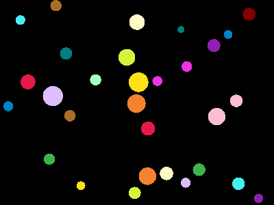

---
format:
  revealjs:
    theme: "black"
    css: "../styles/style.css"
    embed-resources: true
    slide-number: true
    show-notes: separate-page
    mermaid:
      theme: default
    gfm:
    mermaid-format: png
---

## AI プログラミング入門


講師: 寺崎敏志 (Satoshi Terasaki)

---

## はじめに

- 大規模言語モデル(LLM, Large Language Model)の登場で，文章要約，質疑応答，翻訳などの自然言語処理タスクをこなすことができるようになった
- OpenAI のような AI とチャットできるサービスがリリースされ一般の人が気軽に利用できるようになった
- コーディングに特化するエージェント e.g., Codex/Claude Code/Gemini/OpenCode etc... が登場しソフトウェア開発のあり方が大きく変わってきている
- 本講義では AI エージェントを使い，ソフトウェア開発をするための事柄を復習しつつ，AI を使ったソフトウェア開発の方法を案内する

---

## 自己紹介

- 名前: 寺崎敏志 (Satoshi Terasaki)
- 生まれは富山県
- 所属: 物性研究所 川島G にて特任研究員
  - 2026年5月から着任
  - それまではソフトウェア関連で会社員・個人事業主で活動
    - C/C++/Python/Julia/Fortran/JavaScript/数学
  - 個人開発・兼業では AI エジェントを活用し Rust/Julia 周りのソフトウェア整備をしている

---

## 個人の活動で行っていること: PythonRNGs.jl

Python の乱数生成器を Julia から呼び出すためのパッケージ．

```julia
using PythonRNGs
using Random: Random

# random.random
example1(seed) = rand(PythonRandom(seed), 2, 3)
# np.random.random
example2(seed) = rand(NumPyRandom(seed), 2, 3)
# np.random.default_rng(42)
example3(seed) = rand(NumPyDefaultRNG(seed), 2, 3)
```

---

## 個人の活動で行っていること: RustCall.jl

Rust の資源を Julia から呼び出すためのパッケージ．

```julia
using RustCall

rust"""
#[julia]
fn add(a: i32, b: i32) -> i32 {
    a + b
}
"""

# Call directly - wrapper is auto-generated
add(10, 20)  # => 30
```

---

## 個人の活動で行っていること: QuantumEnvelopingAlgebras.jl

量子群の計算をするためのパッケージ．

```julia
import AbstractAlgebra as AA
using QuantumEnvelopingAlgebras

R, q = AA.rational_function_field(AA.QQ, :q)
U, (E, F, K, Ki) = uqsl2(R, q)

@assert E*F - F*E == (K - Ki)/(q - inv(q))
@assert K*Ki == one(U)
```

---

## 実は

- これらの紹介したソフトウェアは AI を活用しています
  - 私が担当した 9 割の実装は AI によって生成したものです
  - AI のおかげで多くのソフトウェアを開発することができるようになりました

- 自分は事前コンパイルするタイプのプログラミング言語は苦手
  - AI が代わりに書いてくれるおかげでより多くのソフトウェアを開発することができるようになりました
  - Rust, Swift, TypeScript などのプログラミング言語を使ったソフトウェア開発も行っています

---

## AI Driven Development

- 人間は自然言語で作りたいものを指示し AI Agent はソースコードを生成・コマンドの実行を行う
  - AI を用いて開発を効率よく進める開発手法を AI-driven 開発と呼ぶ


---

# 従来のソフトウェア開発について

---

## 従来のソフトウェア開発を振り返る

:::{.columns}
::: {.column width="50%"}
- アイデアを考える・仕様を定める
- コードを書く
  - アルゴリズムの実装
    - デバッグを行う
  - テストを書く
  - ドキュメントを書く
- 必要に応じてリファクタリングを行う
- 運用・メンテナンスを行う
- 上記の繰り返しをする
:::

::: {.column width="50%"}

:::
:::

---

## ところで

:::{.columns}
::: {.column width="50%"}
- アイデアを考える・仕様を定める
- コードを書く
  - アルゴリズムの実装
    - デバッグを行う
  - テストを書く
  - ドキュメントを書く
- 必要に応じてリファクタリングを行う
- 運用・メンテナンスを行う
- 上記の繰り返しをする
:::

::: {.column width="50%"}
- あなたは全部真面目に取り組みましたか？
- branch を作って PR 作って レビュー・マージを繰り返す共同開発を進めていましたか？
- 常に効率の良い開発方法を考えていましたか？
- 常に効率の良い開発環境を提供していますか？
- 本当ですか？
  - 特に，テストを書くこと
  - ドキュメントを書くこと
:::
:::

---

## 現実

:::{.columns}
::: {.column width="40%"}

:::

::: {.column width="60%"}
- ソースコードはどこですか？
  - どれが最新のコードですか？
  - バージョン管理されてない!!!
  - code is available!, coming soon! (Not Found)
- ドキュメントがない
  - 古い，間違っている
- なぜこの機能があるのか？
  - 誰が書いたの？
- テストがない
  - 変更したコードが正しく動くかがわからない．
- コンパイルができない
  - 実行時にエラーが起きる
  - 動くけれど変な値が出る
:::
:::

---

## 再現性のあるソフトウェアを！！！

:::{.columns}
::: {.column width="40%"}

:::

::: {.column width="60%"}
- 企業だろうと，研究所だろうと立場がどうあれ，ここにいる皆さんは広義のソフトウェア開発者です
  - 現代的な開発手法を取り入れることを努力するのは必須のスキルです
  - 人を動かす立場の人は快適な開発環境を整えることは必須の役割です
- 再現性があり，安定して動作するソフトウェアを作ることが重要です
- AI を活用したソフトウェア開発は再現性のあるソフトウェアを作るための一つの解決策です
  - その前に，現代的なソフトウェア開発をするための基盤を整える必要があります
:::
:::

---

## 人間と機械

- 人間は「創造」することができるが「疲れる」,「飽きる」,「固執する」，「知識を秘密にする」
  - 「疲れる」: `git commit -m "update" git commit -m "fix"` を使いまくる

```{mermaid}
gitGraph
  commit id: "init"
  commit id: "wip"
  commit id: "tmp"
  commit id: "fix"
  commit id: "fix fix"
  commit id: "ok"
  branch hotfix
  checkout hotfix
  commit id: "pls"
  commit id: "final"
  checkout main
  merge hotfix id: "merge??"
  commit id: "real final (actually)"
```

- 「飽きる」: メンテナンスを止めてしまう
- 「固執する」: 特定のプログラミング言語を使い続ける
  - 数十年の単位で固執するとパッケージマネージャを使うなど現代的な開発手法を取り入れることが困難な環境を生む
- 「知識を秘密にする」: 知っていることを秘密にしてしまう
    - 秘伝のタレができてしまう

---

## 人間と機械

- 機械は「飽きない」,「疲れない」,「モデルが成長」, 「聞いたら教えてくれる」
  - コードの差分から適切なコミット・プリクエストの概要を作成してくれる

```{mermaid}
gitGraph
  commit id: "chore: initialize repository"
  commit id: "docs: add README and contribution guidelines"
  commit id: "feat: add initial project scaffold"
  commit id: "feat: implement core workflow"
  commit id: "test: add unit tests for core workflow"
  commit id: "refactor: simplify core workflow logic"
  commit id: "ci: set up CI pipeline"
  commit id: "chore: prepare v0.1.0 release"

  branch hotfix
  checkout hotfix
  commit id: "fix: resolve crash on empty input"
  commit id: "test: add regression test for empty input"

  checkout main
  merge hotfix id: "merge: hotfix crash on empty input"
  commit id: "chore(release): v0.1.1"
```

- 様々な言語を使える．移植も得意
- その時代・要請に応じて変更が可能．現代的な言語にマイグレーションが可能
- (正しいかは別として)AI に質問すればなんでも答えてくれる

---

## 人間は不要か？

:::{.columns}
::: {.column width="70%"}
- LLM は多くの知識を持っているが，研究者のように最先端の知識を持っているとは限らない．
  - 限られたリソースの中で何を実装するか，しないかは人間の能力に左右される．
- ソフトウェアエンジニアはコーディングする時間から解放されるが次のような能力は必要になる：
  - どのような技術をどの場面で使うか
  - 高品質なソフトウェアを作成・維持するためのアーキテクチャを考える
  - 意思決定をする上位の能力
  - コーディング以外に研究者と議論するための最低限のドメイン知識も求められるようになる．
:::
::: {.column width="30%"}

:::
:::

---

## 現代的な開発手法への招待

- AI を活用したソフトウェア開発をする以前に環境を整えましょう
- バージョン管理をしましょう．
  - Git/GitHub/GitLab などのエコシステムを活用しましょう
- Issue Driven Development をしましょう
  - 問題を定義し，それを解決するためのコードを書くことでソフトウェアを開発しましょう
- TDD(Test Driven Development) をしましょう
  - テストを先に書き，テストが通るようにコードを書く
- CI(Continuous Integration)/CD(Continuous Deployment) パイプラインを構築しテスト・デプロイを自動化しましょう
  - GitHub Actions, GitLab CI/CD
  - クリーンな環境でビルドが通るか・テストが通るか
  - ドキュメントを Web ページに公開
  - `crates.io` や `PyPI` に登録

---

## 現代的な開発手法への招待

- `パッケージマネージャ`が付属している言語を使いましょう
  - 他の人が書いた便利な機能を取り込むことができる
  - 他の人から再利用がしやすい
- 汎用的な部品を切り出し便利な機能を提供すると人類が喜びます
- あなたが作ったソフトウェアはそこで進化が止まりません．常に成長を続け，他者から使われる可能性を秘めています．
- 他者とのコラボレーションが可能になる
- 車輪の再発明を抑えることができる．
- 1つのリポジトリに大規模，密結合になっているとメンテナンスが大変
  - (経験上 AI 時代でも難しい)

---

## 現代的プログラミング言語への招待

- `Julia` は高級な動的言語でありながら高速な実行が可能
  - (科学技術計算の文脈で)既存のプログラミング言語のいいとこどりを目指した欲張りな言語
  - 添字が 1 始まり，多次元配列をサポート・column major
  - ccall, cfunction を用いることで C/Fortran のライブラリを呼び出すことができる
  - Python のライブラリを呼び出すことができる
  - 普段 Fortran ユーザであれば試してみる価値はあり
- 欠点:
  - 動的言語であるので実行時に Runtime Error が発生する可能性がある
    - 動的言語の宿命．JET.jl などの静的解析ツールを使う
  - 型不安定なコード, GC (ガベージコレクション) が頻発するケースではパフォーマンスが出にくい
  - 配列を動的に確保しメモリアロケーションが発生するケースではパフォーマンスが出にくい
    - もちろん対策方法はある. AI に適切な指示を与えることで解決する

---

## 現代的プログラミング言語への招待

- `Rust` はシステムプログラミング言語として導入された言語，高速に動作
  - コンパイルの時点で危険なコードを排除することができる．
    - 未初期化変数，型の不一致，配列の範囲外アクセスをコンパイルの時点で検出することができる
  - デットコード(未使用のコード)の検出など静的解析が優秀
  - `cargo build` で簡単にビルドを進めることができる．
    - オレオレ CMakeLists.txt Makefile を書かなくても良い．
  - 普段 C/C++ ユーザであれば試してみる価値はあり
  - CLI ツールを配布することができる．
- 欠点:
  - コンパイルに時間，コンパイル時に出る中間生成物の量によるストレージの圧迫
  - `sccache`, `kache` を用いることでコンパイル時間を短縮することができる
  - 所有権の理解など，学習コストがかかる
    - AI によるコード生成により開発体験が劇的に改善します

---

# Fortran と Rust の比較

実際に存在しているコードから MWE(Minimum Working Example) を作成して比較します．

使ったプロンプト

```text
このFortranプロジェクトを読んで，潜在的なバグを引き起こす箇所を指摘してください．
エラーを再現するための MWE(Minimum Working Example) を作成してください．
Rust ではどのように記述できるかも示してください．
```

---

## 関数の結果を代入せずに戻る

同符号なら `return` するが、関数結果には一度も代入しない

:::{.columns}
::: {.column width="50%"}
```fortran
program main
  implicit none
  print *, root(1.0, 2.0)
  print *, root(1.0, -5.0)
contains
  real function root(a, b)
    real, intent(in) :: a, b
    if (a * b > 0.0) return
    root = 0.5*(a + b)
  end function root
end program main
```

```sh
$ gfortran -O0 repro.f90 && ./a.out
   1.40129846E-45
  -2.00000000
```
:::
::: {.column width="50%"}
```rust
fn root(a: f64, b: f64) -> f64 {
    let result: f64;
    if a * b > 0.0 {
        return result;
    }
    0.5 * (a + b)
}

fn main() {
    println!("{}", root(1.0, 2.0));
}
```

```sh
$ rustc repro.rs
error[E0381]: used binding `result` isn't initialized
```
:::
:::

---

## 範囲外アクセス

- `-O3` フラグでコンパイルすると `a` だけではなく `b` の方にも値を書いてしまう．(意図しない書き込み)
- Rust では `panic` を発生し処理を止める．

:::{.columns}
::: {.column width="50%"}
```fortran
program main
  implicit none
  real :: a(4)
  real :: b(4) ! Uninitialized array
  integer :: i, n
  n = 7
  do i = 1, n
     a(i) = real(i)
  end do
  print *, a
  print *, b
end program main
```

```sh
$ gfortran -O3 repro.f90 && ./a.out
   1.00000000       2.00000000       3.00000000       4.00000000
   5.00000000       6.00000000       7.00000000       0.00000000
```
:::
::: {.column width="50%"}
```rust
fn main() {
    let mut a = [0.0f64; 4];
    let n = 6;
    for i in 1..=n {
        a[i - 1] = i as f64;
    }
    println!("{a:?}");
}
```

```sh
$ rustc -C opt-level=3 repro.rs && ./repro
thread 'main' (5500909) panicked at repro.rs:5:9:
index out of bounds: the len is 4 but the index is 4
note: run with `RUST_BACKTRACE=1` environment variable to display a backtrace
```
:::
:::

---

## 代入していない変数を式に使う

- Fortran だとコンパイルも通るし，実行もされてしまう．
- Rust は初期化していない束縛を読めず、コンパイルできない。

:::{.columns}
::: {.column width="50%"}
```fortran
program main
  implicit none
  real :: omega, factor
  factor = 1.0/omega**2
  print *, factor
end program main
```

```sh
$ gfortran repro.f90 && ./a.out
         Infinity
```
:::
::: {.column width="50%"}
```rust
fn main() {
    let omega: f64;
    let factor = 1.0 / omega.powi(2);
    println!("{factor}");
}
```

```sh
$ rustc repro.rs
error[E0381]: used binding `omega` isn't initialized
 --> repro.rs:3:24
  |
2 |     let omega: f64;
  |         ----- binding declared here but left uninitialized
3 |     let factor = 1.0 / omega.powi(2);
  |                        ^^^^^ `omega` used here but it isn't initialized
```
:::
:::

---

## ローカル変数が外側の値を隠す

- ローカルの `omega` がモジュールの `omega` を隠す. 外側には `2.0` があるが、サブルーチン内の同名の変数には一度も代入しない.

:::{.columns}
::: {.column width="50%"}
```fortran
module m
  implicit none
  real :: omega = 2.0
contains
  subroutine setup()
    real :: omega
    print *, omega
  end subroutine setup
end module m

program main
  use m
  call setup()
end program main
```

```sh
$ gfortran repro.f90 && ./a.out
   2.80259693E-45
```
:::
::: {.column width="50%"}
```rust
fn setup(_omega_outer: f64) -> f64 {
    let omega: f64;
    omega
}

fn main() {
    println!("{}", setup(2.0));
}

```

```sh
$ rustc repro.rs
rustc repro.rs
error[E0381]: used binding `omega` isn't initialized
 --> repro.rs:3:5
  |
2 |     let omega: f64;
  |         ----- binding declared here but left uninitialized
3 |     omega
  |     ^^^^^ `omega` used here but it isn't initialized
```
:::
:::

---

## まとめ

このように Fortran (人手) で書かれたコードのバグを Rust ではコンパイラの時点で検出することができます．
また，範囲外アクセスについてはパニックによって実行時エラーが発生し，意図しない数値計算を止めることができます．

---

## Julia に関して

- Julia は JIT コンパイルで動作する
- 動的言語なので，Rust ほど厳格ではないが，高速な実行が可能な言語
- REPL, IJulia.jl, Pluto.jl などのインタラクティブな環境を提供している
- パッケージマネージャが付属しているので，他の人が書いた便利な機能を取り込むことができる
  - メンテナは科学技術計算周りのコミュニティが多いので，科学技術計算で使われている機能が利用できる
- 実行時することでエラーを見つけることになる（動的言語の宿命）
  - とはいえ，未定義変数に対しては `UndefVarError`, 範囲外アクセスに対しては `BoundsError` などでエラー種類を見つけやすくなる
  - JET.jl を使用することで静的解析を行うことができるが，まだまだ発展途上です
  - スタックトレースでどの箇所でエラーが起きているか特定することができる
- どれくらい速度が出るかは次のページで

---

## MvNormal のサンプリング速度比較

64次元多変数正規分布 $N(\mu, \Sigma)$ に従うサンプリング点 20000 点を生成する速度の比較．

- Setup は `Σ = L Lᵀ` をCholesky 分解で求めるコスト．
- `x = μ + L z` を計算．`z` は `Ziggurat` 法によるサンプリングを使用．
- [https://github.com/terasakisatoshi/MvNormalBenchmark](https://github.com/terasakisatoshi/MvNormalBenchmark) DeepSeek 4.1 Flash, Codex を使用．
- Python は Numba を使用

<div style="font-size: 0.7em">

Language         | Setup (ms) | Avg sampling (ms) | Min sampling (ms)
:--------------- | ---------: | ---------------: | ---------------:
julia-ziggurat   | 0.072      | 9.633            | 9.583
cxx-ziggurat     | 0.026      | 9.624            | 9.495
fortran-ziggurat | 0.026      | 12.310           | 12.243
rust-ziggurat    | 0.029      | 9.436            | 9.400
python-ziggurat  | 0.131      | 15.547           | 15.475

</div>

---

## 簡単な Poisson 方程式のベンチマーク

[https://github.com/terasakisatoshi/poisson_eq_jacobi_benchmark](https://github.com/terasakisatoshi/poisson_eq_jacobi_benchmark) Poisson 方程式の Jacobi 法を比較したベンチマーク．

<div style="font-size: 0.7em">

M5 チップ搭載の Macbook Pro での実行結果．

| Implementation | Language | Time (s) |
|---|---|---:|
| julia | Julia | 3.977462 |
| julia_unsafe | Julia (unsafe) | 3.443576 |
| python | Python + Numba | 3.965009 |
| cxx | C++23 | 3.582923 |
| fortran | Fortran 2008 | 4.041347 |
| rust | Rust | 4.620172 |

</div>

---

## まとめ

Julia については文法を何も説明していないが，数値計算で使われている他の言語に劣らず高速に動作することがわかるだろう．

---

# 環境構築

- [Preparation](../handouts/preparation.qmd) を参照してください．

---

# Agentic Coding

---

## Agentic Coding

- Agentic Coding は AI エージェントが自律的にコーディングを行う手法
- デモは Claude Code, Cursor を使用するが，基本的なコンセプトは他のサービスでも同様

---

## 何ができるのか?(Rust版)

自然言語を用いて AI に指示をし，プログラムを組むことができる．

```text
I want to create a Rust crate for simulating and visualizing elastic collisions of multiple balls in 2D space.
```

ここでは英語で書いたが，もちろん日本語でも可能．具体的な指示を与えるとスムーズにいく

```text
2D 空間で複数のボールの弾性衝突をシミュレートし、GIF で可視化する Rust クレートを作って。
`./rust/` に作成。確認や設計の質問はせず、そのまま実装まで進めて。
仕様に書かれていない細部は、下の「既定の判断」に従い、それ以外は自分で決めて最後に報告すること。

## 物理

- 円(半径・質量が異なる。質量 = π r²)、箱は 800×600(原点は左上、y は下向き)。
- 玉同士は完全弾性衝突、壁は弾性反射。重力・摩擦・回転はなし。
- アルゴリズム: 固定時間ステップ + 重なり検出 + 力積解決 + 位置補正。ペア判定は O(n²)。
- 1 ステップの順序は「移動 → 玉同士 → 壁」(壁を最後にして、ステップ後は必ず箱の内側にする)。
- 玉同士の判定: n を a→b の単位法線として、重なっていれば常に位置を分離し、
  接近中((v_a − v_b)·n > 0)のときだけ力積 j = 2(v_a − v_b)·n / (1/m_a + 1/m_b) を適用
  (v_a −= j/m_a·n、v_b += j/m_b·n)。
- 壁: 位置を箱の内側へ戻し、その軸の速度を内向きに揃える(すでに内向きなら反転しない)。

## 可視化

- ウィンドウは不要。GIF のみ(ヘッドレス)。
- `gif` クレート + 自前のソフトウェア描画(パレットインデックスのバッファに円を塗る。アンチエイリアスなし)。
- パレットは黒の背景 + 16 色(ボール i は 1 + i % 16 番。16 色は互いに異なり、黒でない)。
- 25 fps(遅延 4/100 秒)、1 フレーム 4 サブステップ(固定 dt = 1/100 秒)、縮尺 0.5(出力 400×300)、無限ループ。
- 各フレームは「描画 → 4 サブステップ」の順(1 枚目は初期状態)。

## CLI

- `cargo run --release -- [--out collisions.gif] [--balls 30] [--seed 42] [--seconds 10]`
- 引数解釈は手書き(`clap` は使わない)。不正な値はエラー(メッセージ + usage を stderr、終了コード 1)。
  不正: 未知の引数、値の欠落(次が `--` で始まる場合も欠落)、`--balls` が 0 以下/整数でない、
  `--seed` が非負整数でない、`--seconds` が非有限・0 以下、または 25 fps で 1 フレームも作れない長さ。
- 終了時に出力先・フレーム数(= round(seconds × 25))・初期/最終の運動エネルギーを表示。

## 構成

- lib + bin。`Vec2` / `Ball` / `World` / `render` / `gif_export` / `animation` / `cli` / `main` に分ける。
  物理(`Vec2` / `Ball` / `World`)は描画に依存させない。
- 依存は `gif = "0.14"` と `rand = "0.8"`(0.8 に固定)のみ。
- `World::new(balls) -> Result<World, Error>` は検証する(半径が正の有限値、位置・速度が有限、
  箱の内側(接するのは可)、重なりなし)。
- `World::random(n, seed) -> Result<World, Error>` は再現可能で、重ならない初期配置を返す(乱数は `StdRng`)。
  半径 10〜30、速さ 20〜200、向きは一様。配置できなければ `PlacementFailed`。
- 入力検証・CLI・I/O・GIF のエラーは `Error` 列挙型にまとめ、`Display` と `std::error::Error` を実装する。

## 既定の判断(仕様の空白)

- 位置分離は両玉に重なりの半分ずつ配分する。中心が一致する場合は x 軸を仮の法線とする。
- GIF 書き出しはフレームのイテレータを受け取り、フレームなし・サイズ不一致は `Error`。
- `animate` は世界を `&mut` で進め、`Vec<Frame>` を返す(最終エネルギーを呼び出し側が読めるように)。

## 開発の進め方

- t_wada 流 TDD(Red → Green → Refactor)。テストを先に書き、失敗を確認してから最小の実装で通す
  (未実装 API によるコンパイルエラーも Red とみなしてよい)。
- テストの順序は、Vec2 → Ball → World 検証 → 自由運動と壁 → 衝突(分離 → 力積 → 接近ガード)
  → 運動量/エネルギー/random → 描画 → GIF → animate → CLI。
- 長時間のプロパティテスト(`tests/`、複数シード×5000 ステップ、玉数も変える)で、
  運動エネルギーの保存(相対誤差 1e-9 未満)と全ステップで箱の内側に留まることを確認。同シードで決定的なことも確認。
- **コミットはしない**(`.gitignore` に `/target` だけ追加)。
- 完了条件:
  - `cargo test` 全通過、`cargo clippy --all-targets -- -D warnings` が警告なし。
  - 既定設定で GIF を実際に生成し、寸法 400×300・250 フレーム・遅延 40ms・無限ループを確認し、
    フレームを画像として見て円が描かれていることを確認(生成物はリポジトリに置かない)。
  - 最後に、自分で決めた仕様外の判断を短く報告する。
- スコープ外: ライブウィンドウ、HUD、アンチエイリアス、重力、マウス操作、空間分割。
```

---

## 何ができるのか?(Julia版)

自然言語を用いて AI に指示をし，プログラムを組むことができる．

```text
I want to create a Julia package for simulating and visualizing elastic collisions of multiple balls in 2D space
```

ここでは英語で書いたが，もちろん日本語でも可能．具体的な指示を与えるとスムーズにいく

```text
2D 空間で複数のボールの弾性衝突をシミュレーションし、可視化する Julia パッケージ
ElasticCollisions を ./julia 以下に作ってください。質問はせず、以下の決定事項に従ってください。
設計書は書かず、コミットもしないでください。開発は TDD で進めてください
（先に失敗するテストを書き、失敗を確認してから実装する）。

## 物理とシミュレーション
- ボールは、位置・速度・半径（> 0）・質量（> 0）を持つ剛体の円盤です。
  半径と質量はボールごとに異なってよいです。重力と摩擦はありません。
- 容器は、反射壁を持つ矩形 [0, width] x [0, height] です。
  型名は `Box` ではなく `Arena` にしてください。Makie が `Box` を export しているため、
  `using ElasticCollisions, CairoMakie` すると名前が曖昧になります。
- 時間発展はイベント駆動にします。壁・ボール対の衝突時刻を厳密に計算し、
  全ボールを最も早いイベントまで進めて衝突を解き、これを繰り返します。
  固定時間刻みは使いません。
  - ボール対の衝突時刻: |dx + dv t| = r1 + r2 の小さい方の根。ボール同士が接近中
    （dx・dv < 0）のときだけ対象にします。接触したまま離れていくペアが
    再衝突しないようにするためです。
  - ボール対の衝突: 中心を結ぶ線方向の速度成分を質量に応じて交換します。
    接線方向の成分は変えません。
  - 同時イベント（コーナーなど）は 1 つずつ順に処理します。
  - イベントごとの候補探索は、素朴な O(n^2) で十分です。

## 初期条件
- ボールは `Ball((x, y), (vx, vy), radius, mass)` で明示的に指定できます。
- `random_balls(n; arena, radius, speed, mass = 1.0, seed = nothing)` は、
  重ならないボールを棄却サンプリングで生成します。向きはランダム、速さは指定値です。
  `seed` で再現でき、乱数生成器は `Random.Xoshiro` を使います。
  配置できなければ `ArgumentError` を投げます。
- `World(balls, arena)` は、ボールがアリーナからはみ出す、またはボール同士が重なる場合に
  `ArgumentError` を投げます。

## API
- export するもの: `Ball`, `Arena`, `World`, `Trajectory`, `kinetic_energy`, `simulate`,
  `random_balls`, `save_gif`。
- `simulate(world, T; frame_dt) -> Trajectory`。フィールドは `arena`, `times`,
  `frames::Vector{Vector{Ball}}` です。フレームは `World` ではなく単なるボールの
  ベクトルで持ちます。接触時の丸め誤差程度の重なりで、検証エラーが出ないようにするためです。
  `T` が負、または `frame_dt` が正でない場合は `ArgumentError` を投げます。
- 内部ヘルパー（`time_to_wall`, `time_to_pair`, `collide_pair`, `collide_wall`,
  `advance`）は export しません。テストでは明示的に import します。

## 可視化: CairoMakie による GIF 出力（パッケージ拡張）
- CairoMakie は weakdep にし、`ext/` に拡張 `ElasticCollisionsCairoMakieExt` を置きます。
  コアパッケージの依存は標準ライブラリの `Random` だけにします。
- コアでは `function save_gif end` を定義し、拡張が
  `save_gif(path, trajectory; fps = 30, size = (800, 500)) -> path` を実装します。
- ボールは `Circle(center, radius)` の `poly!` で描きます（`markersize` 付きの
  `scatter!` は使いません。データ座標の半径と一致しないためです）。
  あわせて、アリーナの枠線、`DataAspect`、`t = ...` のタイトル、ボールごとの色を用意します。
  録画は、Observable のフレーム番号で駆動する `record(...)` で行います。

## 構成とツール（aa-jl スキルに従う）
- カレントディレクトリに in-place レイアウトで作ります:
  `Project.toml`, `src/`, `ext/`, `test/`, `README.md`, `.gitignore`
  （Manifest.toml, test/Manifest.toml, *.gif を無視）。
- UUID は `UUIDs.uuid4()` で生成します。すべての依存と weakdep に `[compat]` を付けます。
  テスト環境が `[workspace]` と `[sources]` を使うため、`julia = "1.12"` にします。
- テストは workspace 方式のテスト環境を使います（`test/Project.toml` に、パッケージ本体、
  Test、CairoMakie、Aqua を入れる）。weakdeps や extensions を編集した後は
  `Pkg.resolve()` を実行してください。実行しないと拡張が読み込まれません。

## テスト（先に書く）
1. 型: Ball / Arena / World の検証、`kinetic_energy`。
2. イベント: 壁との衝突時刻と壁の名前、ボール対の衝突時刻（接近中、離れていく、
   すれ違う、接触して接近中、接触して離れていく）、`advance`、壁での反射、
   質量が等しい 2 球の正面衝突での速度交換、質量が異なる場合の運動量とエネルギーの保存。
3. `simulate`: フレーム時刻、壁の間で跳ね返る 1 球、正面衝突、引数エラー。
4. `random_balls`: 妥当性、再現性、`mass` キーワード、配置不可能なケース。
5. 長時間の実行（質量の異なる 20 球、T = 200）: 運動エネルギーの保存（rtol 1e-9）、
   全ボールがアリーナの内側にあること、重なりがないこと（許容誤差 1e-9）。
6. `save_gif` が、GIF87a または GIF89a で始まり、フレームごとに 1 つ以上の
   画像ブロックを持つファイルを書き出すこと。
7. `Aqua.test_all(ElasticCollisions)`。
最後に `julia --project -e 'using Pkg; Pkg.test()'` が通ることを確認してください。

## エントリーポイントのスクリプト
ユーザーが次の手順で GIF を得られるようにしてください:

    cd app
    julia --project main.jl

CairoMakie は weakdep なので、ルートの環境からは読み込めません。そのため、スクリプトは
`app/` に置き、専用の `Project.toml`（依存は、`[sources] path = ".."` 経由の
ElasticCollisions と CairoMakie）を用意し、ルートの `[workspace]` に `"app"` を
追加してください。`app/main.jl` は、`Arena(10, 6)`、ランダムな 15 球
（半径 0.4、速さ 3、seed 7）を作り、30 fps で 10 秒間シミュレーションして
`app/collisions.gif` を書き出します。実際に実行し、途中のフレーム（PIL などで抽出）を
見て、ボールが動いていること、重なっていないこと、アリーナ内に収まっていることを
確認してください。

使い方（サンプルコード、クイックスタート、テストの実行方法）は README.md に書いてください。
```

---

## できるもの

Sonnet 5.5 (medium) による生成物．諸々込みで10分で作成できる．



---

## どのツール・エージェントを？

- AI は常に進化するので，単純な答えはない．
  - 各自の予算・目的・開発のフローに応じて適切なツール・エージェントを選ぶべき．
  - 本講義は 20 ドルプランがあれば十分楽しめるはずだ．
- ChatGPT を契約しているならば:
  - Codex が使えるのでそれを使えばよい．
  - 本講義の内容は GPT-5.6-Luna で十分
- Claude を契約しているならば:
  - 本講義の内容であれば Sonnet 5.5 (medium) で十分
- VS Code のような開発体験を提供している IDE を使っているならば:
  - Cursor を使えばよい
  - Grok 4.7 High Fast というモデルを使えばよい．

---

## 私の場合

あくまで個人の環境での話です．特定のサービスを推奨するものではありません！！！

- ISSP の業務では Claude Code, Cursor を使っている
- 個人の活動
  - Claude Code (OSS デベロッパープログラムに加入)
  - ChatGPT (画像生成，高校数学の問題を解く，諸々の相談，Codex)
  - Cursor (文章執筆，スライドの作成)
  - OpenCode (DeepSeek v4.1 Flash，API経由で)
  - Kimi (AIが行った作業の日報作成用)
- コーディングタスクは VPN 経由で自宅の Linux, macOS マシンにアクセスして行っている

- ちなみに
  - ウルトラワイドモニターは作業が捗る

---

## 基本的なコマンド

Claude Code

```text
/init # CLAUDE.md の生成
/login # ログイン
/usage # 使用量の確認
/<skill-name> # コマンド・スキルの実行
/plugins # プラグインの導入など
/compact # コンテキストを圧縮
/model # モデルの変更
/resume # セッションの再開
/goal # ゴールの設定
/clear # 新しいセッションを開始
```

Codex

```text
/init # AGENTS.md の生成
/login # ログイン
/status # 使用量の確認
/resume # セッションの再開
/model # モデルの変更
/compact # コンテキストを圧縮
/goal # ゴールの設定
/clear # 新しいセッションを開始
```

---

## AI Agent の動作原理

- ユーザが入力した指示(プロンプト)をエージェントが理解し，その指示に従って行動を行う．
- 多くはクラウド環境にあるGPUなどのアクセラレータで計算を実施
- 計算結果をクラウド環境から返却し，ユーザに提示する．
- Bash, Edit, Read, Write などのファイルの操作，コマンドの実行を実施することがある．

---

## 注意事項

- サービスによっては入力が学習に使われることもある．
  - プライバシーポリシーを確認すること
  - 例えば OpenCode Zen で提供されている無料の「ステルスモデル」など
- 学習に使われない場合でも，外部にデータを送信することには変わらない
  - 個人情報(住所，パスワード，APIキー)を入力しない
  - 機密情報（各組織のルールに依存）を入力しない
- 必要に応じて Local LLM の検討も行うとよい

---

## AI Agent の動作原理

ユーザが `i+1` 回目の会話を開始するとき，エージェントは 「1 から `i` 回目までのユーザメッセージと対応する回答」を Claude 内部が持っている機械学習モデルに入力として渡している．

その入力をもとにモデルは回答を生成している．

このようにしないと，「これまでの議論をまとめ」てといった人間の指示(プロンプト)への回答に対応できない．


画像は [Claude の公式ドキュメントより引用](https://platform.claude.com/docs/en/build-with-claude/context-windows)．

---

## セッションが切れると会話を忘れる

`/clear` コマンドを実行すると，セッションが切れる．それまでの会話は忘れてしまう．

```text
やっほー
(Claude がやっほーというメッセージに対して回答する)
/clear
さっき言ったこと覚えてる？
(Claude は覚えてないと回答する)
```

ナイーブに運用するとセッションごとに同じ説明をユーザは入れないといけない．

---

## セッションをずっと保持すれば？

- そういうわけではない．
- ワーキングメモリに投入するトークンが増えるにつれて，回答精度が低下するコンテキストロット context rot と呼ばれる現象が生じる．
- 1回のセッションに投入するコンテキスト・文脈は必要なものに留めるのがよい．予算的にも，モデルの精度的にも．
- 1 セッションでは一つの目的に集中するのがよい．
- `/compact` コマンドを実行すると，コンテキストを圧縮することができる．

---

## `AGENTS.md`, `CLAUDE.md` の生成

- プロジェクトごとのルール・原則をまとめたファイル．エージェントを起動するとこれが読み込まれる．
- `/init` で既存のプロジェクトに対するルールを推測し，`AGENTS.md` を生成することもできる．
- Claude Code では `CLAUDE.md` という名前で生成される．
  - 最近 `AGENTS.md` を読み込むこともサポートされた．

[Claude Code の公式ドキュメント](https://code.claude.com/docs/ja/memory#write-effective-instructions) によれば 200 行以下であることが望ましい．

特定の状況で行うべき作業の内容，ワークフローの詳細はスキル(skills)として定義することができる.

---

## スキル(skills)

特定の状況で行うべき作業の内容，ワークフローの詳細を記述したもの．実態YAML Frontmatter と Markdown フォーマットで記述されたファイル．


`description` には発動条件を書く．Markdown には作業内容を記述する．

---

## スキルの例

- [obra/superpowers](https://github.com/obra/superpowers)
  - ソフトウェア開発のベストプラクティスに則り行動を促すスキル
- [GiggleLiu/agentic-tests](https://github.com/GiggleLiu/agentic-tests)
  - エージェントが生成したドキュメント，スキルが有効に動作するかを検証するスキル
- [coji/natural-japanese](https://github.com/coji/natural-japanese)
  - 自然な日本語での会話を促すスキル
- [AtelierArith/atelier-arith-julia-development-skills](https://github.com/AtelierArith/atelier-arith-julia-development-skills)
  - Julia でのソフトウェア開発のベストプラクティスに則り行動を促すスキル

---

## スキル導入時の注意事項

- スキルはエージェントの振る舞いを変更するので，悪意のあるスキルを導入するとエージェントが不正な行動を行う可能性がある．
- [skill-scanner](https://github.com/cisco-ai-defense/skill-scanner) を使ってスキルに悪意のあるプロンプト，潜在的なリスクのあるスクリプトの実行の誘導を検知することができる．

```sh
$ uv init
$ mkdir ./tmp
$ cd ./tmp
$ uv init
$ uv add cisco-ai-skill-scanner
$ uv run skill-scanner scan-all <path/to/skills> # スキルをスキャン
```

---

## スキルの使用法

- 状況に応じてエージェントが自動的にスキルを使用する
- Claude Code, OpenCode では `/<skill-name>` のように明示的に呼び出すことができる．
- "<skill-name> を使って XXX を行ってください" のように指示を出してもよい．

---

## MCP (Model Context Protocol)

(おもに)AIツールが外部リソースを取得するために作られた通信プロトコルの一つ

下記のようなことは，Bash, Web 検索するツールを用いない限り，苦手・事実上不可能．

- 今何時？ # 時刻取得はコマンドで取得可能だが，LLM 自体がその知識を持っているわけではない
- 今日の天気は？ # 天気予報は外部リソースへのアクセスが必要
- "XXX のデータを見せて" # データベースへのアクセスが必要
- "GitHub の Issue を読んで" # 外部リソースへのアクセスが必要

---

## MCP の例

```
$ claude mcp add --scope user time -- uvx mcp-server-time --local-timezone=Asia/Tokyo
$ claude
❯ 今何時？ シェルコマンドを使わないで教えてくれる？
  Called time # time という MCP サーバーを呼び出している
今は日本時間で 2026年9月30日（水）14:46 です。 # 時刻を返却している
```

[実装はこちら](https://github.com/modelcontextprotocol/servers/blob/4503e2d12b799448cd05f789dd40f9643a8d1a6c/src/time/src/mcp_server_time/server.py#L61-L71)

アンインストールは次のようにして行うことができる．

```sh
$ claude mcp remove --scope user time
```

---

## FastMCP による MCP サーバの作成

FastMCP v2 packgae を使えば FastAPI のようなノリでサーバを作ることができる．

```python
from fastmcp import FastMCP

mcp = FastMCP("demo-server")

@mcp.tool()
async def hello(name: str) -> str:
    return f"Hello, {name}!"

if __name__ == "__main__":
    mcp.run()
```

## FastMCP のクライアント例

```python

# 前のページの server.py と同じ階層に作成
import asyncio
from fastmcp import Client

async def test_hello():
    async with Client("server.py") as client:
        result = await client.call_tool(
            "hello",
            {
                "name": "Yamada Taro"
            }
        )
        print(result.structured_content["result"])

if __name__ == "__main__":
    asyncio.run(test_hello())
```

次のようになる

```sh
$ uv run client.py
 INFO     Starting MCP server 'demo-server' with transport 'stdio'
Hello, Yamada Taro!
```

---

## MNIST のデータを使ったサンプル

Claude Code ユーザ向け

```sh
$ cd handouts/mcp/mnist/web_claude
$ uv sync
$ uv run python download_data.py
$ uv run python app.py
```

Codex ユーザ向け

```sh
$ cd handouts/mcp/mnist/web_codex
$ uv sync
$ uv run python download_data.py
$ uv run python app.py
```

---

## サンドボックス環境の構築

`handouts/devcontainer` 以下にあるディレクトリで開発環境を構築することができる．

VS Code や Cursor などの IDE で開発環境を構築することができる．

OpenCode を使うことで無料で使えるモデルがあるが，モデルの改善に使われる可能性があることに留意すること．

---

## その他応用

- Coding Agent は他言語への移植が得意である．
  - 単体テストが書かれていれば現代的な言語へ移行ができる
- 複数のプログラミング言語を操ることができる．
  - 複数の観点からアルゴリズム，パフォーマンスを見直すことができる
  - 動的言語だからといって遅いわけではない
  - 静的言語を使うからといって無条件に高速にはならない
    - 適切なアルゴリズム，データ構造，ライブラリを使う必要がある．

---

## Math Quiz

二つのの正の整数 $a$, $b$ が与えられた時，最大公約数 $\gcd(a,b)$ が 1 になる確率はどれくらい？

::: {.fragment}
正解は

$$
\begin{aligned}
\mathrm{Prob}(\gcd(a, b) = 1)
&= \frac{1}{\zeta(2)} \\
&= \frac{6}{\pi^2} \\
&\approx 0.6079271018540267 > 0.5
\end{aligned}
$$

ここで，$\zeta$ はリーマン・ゼータ関数である．

$$
\zeta(s) = \sum_{n=1}^{\infty} \frac{1}{n^s}= \prod_{p: \mathrm{primes} } \left(\frac{1}{1 - p^{-s}}  \right) \mathrm{}
$$

ここで，2番目の等式は Euler product として知られている等式である．
:::

---

## 証明

$$
\begin{aligned}
\mathrm{Prob}(\gcd(a, b) = 1)
&= \prod_{p: \mathrm{primes} } \left( 1 - \mathrm{Prob}(p | a \textrm{ and } p | b)\right) \\
&= \prod_{p: \mathrm{primes} } \left( 1 - \mathrm{Prob}(p | a)\mathrm{Prob}(p | b)\right) \\
&= \prod_{p: \mathrm{primes} } \left( 1 - \frac{1}{p}\cdot\frac{1}{p}\right) \\
&= \prod_{p: \mathrm{primes} } \left( 1 - p^{-2}\right) \\
&= \left(\prod_{p: \mathrm{primes} } \left(\frac{1}{1 - p^{-2}}  \right)\right)^{-1} \\
&=\left(\zeta(2)\right)^{-1} \\
&= \frac{1}{\zeta(2)} = \frac{6}{\pi^2}
\end{aligned}
$$

---

## Application (JS implementation)

先ほどの証明から次を得る:

$$
\pi = \sqrt{\frac{6}{\mathrm{Prob}(\gcd(a, b)=1)}}
$$

数値計算で確かめてみよう

```js
// Function to approximate pi
// using probability that two numbers are coprime
function calcPi(N) {
    let cnt = 0;    // Counter for coprime pairs
    // Loop through all pairs (a, b) where 1 <= a, b <= N
    for (let a = 1; a <= N; a++) {
        for (let b = 1; b <= N; b++) {
            // Check if a and b are coprime
            if (mygcd(a, b) === 1) {
                cnt += 1;  // Increment counter if coprime
            }
        }
    }
    // Probability that two numbers are coprime
    let prob = cnt / (N * N);
    // Approximate pi using the formula: pi ≈ sqrt(6 / prob)
    return Math.sqrt(6 / prob);
}
```

---

## Application (JS implementation)

最大公約数を利用して $\pi \approx 3.14...$ を計算しよう:

```js
// approx_pi_gcd.js

// Function to compute the greatest common divisor (GCD) using the Euclidean algorithm
function mygcd(a, b) {
    // Loop until the remainder is zero
    while (b !== 0) {
        let tmp = b;    // Store the value of b temporarily
        b = a % b;      // Update b to the remainder of a divided by b
        a = tmp;        // Set a to the previous value of b
    }
    return a;           // When b is zero, a is the GCD
}

// Function to approximate pi using probability that two numbers are coprime
function calcPi(N) {
    let cnt = 0;    // Counter for coprime pairs
    // Loop through all pairs (a, b) where 1 <= a, b <= N
    for (let a = 1; a <= N; a++) {
        for (let b = 1; b <= N; b++) {
            // Check if a and b are coprime
            if (mygcd(a, b) === 1) {
                cnt += 1;  // Increment counter if coprime
            }
        }
    }
    // Probability that two numbers are coprime
    let prob = cnt / (N * N);
    // Approximate pi using the formula: pi ≈ sqrt(6 / prob)
    return Math.sqrt(6 / prob);
}

// Main function to run the pi approximation
function main() {
    let N = 10000;            // Number limit for coprimality checking
    let pi = calcPi(N);       // Approximate pi
    console.log(`N: ${N}`);   // Output N
    console.log(`pi: ${pi}`); // Output approximation of pi
}

main(); // Call the main function
```

Result

```sh
$ node approx_pi_gcd.js
calcPi: 2.175s
N: 10000
pi: 3.141534239016629
```

---

## Exercise

先ほどの JavaScript のコードを Julia, Rust に移植してください．
`N=10000` の時の実行時間を計測してください．

#### Hint

下記のプロンプトを使う

> Port `approx_pi_gcd.js` to Julia and save the result as approx_pi_gcd.jl

> Port `approx_pi_gcd.rs` to Rust and save the result as approx_pi_gcd.rs

---

## Answer(Julia)

```julia
# Function to compute the greatest common divisor (GCD) using the Euclidean algorithm
function mygcd(a, b)
    # Loop until the remainder is zero
    while b != 0
        tmp = b    # Store the value of b temporarily
        b = a % b  # Update b to the remainder of a divided by b
        a = tmp    # Set a to the previous value of b
    end
    return a       # When b is zero, a is the GCD
end

# Function to approximate pi using probability that two numbers are coprime
function calcPi(N)
    cnt = 0    # Counter for coprime pairs
    # Loop through all pairs (a, b) where 1 <= a, b <= N
    for a in 1:N
        for b in 1:N
            # Check if a and b are coprime
            if mygcd(a, b) == 1
                cnt += 1  # Increment counter if coprime
            end
        end
    end
    # Probability that two numbers are coprime
    prob = cnt / (N * N)
    # Approximate pi using the formula: pi ≈ sqrt(6 / prob)
    return sqrt(6 / prob)
end

# Main function to run the pi approximation
function main()
    N = 10000            # Number limit for coprimality checking
    approx_pi = @time calcPi(N) # Approximate pi and time it
    println("N: $(N)")   # Output N
    println("pi: $(approx_pi)") # Output approximation of pi
end

main() # Call the main function
```

Result

```julia
$ julia approx_pi_gcd.jl
  1.865392 seconds
N: 10000
pi: 3.141534239016629
```

---

## Answer (Rust)

```rust
// Function to compute the greatest common divisor (GCD) using the Euclidean algorithm
fn mygcd(a: u64, b: u64) -> u64 {
    let mut a = a;
    let mut b = b;
    // Loop until the remainder is zero
    while b != 0 {
        let tmp = b;    // Store the value of b temporarily
        b = a % b;      // Update b to the remainder of a divided by b
        a = tmp;        // Set a to the previous value of b
    }
    a                   // When b is zero, a is the GCD
}

// Function to approximate pi using probability that two numbers are coprime
fn calc_pi(n: u64) -> f64 {
    let mut cnt = 0u64; // Counter for coprime pairs
    // Loop through all pairs (a, b) where 1 <= a, b <= N
    for a in 1..=n {
        for b in 1..=n {
            // Check if a and b are coprime
            if mygcd(a, b) == 1 {
                cnt += 1;  // Increment counter if coprime
            }
        }
    }
    // Probability that two numbers are coprime
    let prob = cnt as f64 / (n as f64 * n as f64);
    // Approximate pi using the formula: pi ≈ sqrt(6 / prob)
    (6.0 / prob).sqrt()
}

// Main function to run the pi approximation
fn main() {
    let n = 10000u64;   // Number limit for coprimality checking
    let start = std::time::Instant::now();
    let pi = calc_pi(n); // Approximate pi
    let duration = start.elapsed();
    println!("calcPi: {:?}", duration);
    println!("N: {}", n);   // Output N
    println!("pi: {}", pi); // Output approximation of pi
}
```

Result

```sh
$ rustc -C opt-level=3 approx_pi_gcd.rs && ./approx_pi_gcd
calcPi: 1.754083333s
N: 10000
pi: 3.141534239016629
```

---

## Answer (C)

```c
#include <stdio.h>
#include <math.h>
#include <time.h>

// Function to compute the greatest common divisor (GCD) using the Euclidean algorithm
int mygcd(int a, int b) {
    // Loop until the remainder is zero
    while (b != 0) {
        int tmp = b;    // Store the value of b temporarily
        b = a % b;      // Update b to the remainder of a divided by b
        a = tmp;        // Set a to the previous value of b
    }
    return a;           // When b is zero, a is the GCD
}

// Function to approximate pi using probability that two numbers are coprime
double calcPi(int N) {
    int cnt = 0;    // Counter for coprime pairs
    // Loop through all pairs (a, b) where 1 <= a, b <= N
    for (int a = 1; a <= N; a++) {
        for (int b = 1; b <= N; b++) {
            // Check if a and b are coprime
            if (mygcd(a, b) == 1) {
                cnt += 1;  // Increment counter if coprime
            }
        }
    }
    // Probability that two numbers are coprime
    double prob = (double)cnt / (N * N);
    // Approximate pi using the formula: pi ≈ sqrt(6 / prob)
    return sqrt(6.0 / prob);
}

// Main function to run the pi approximation
int main() {
    int N = 10000;            // Number limit for coprimality checking
    clock_t start = clock();
    double pi = calcPi(N);    // Approximate pi
    clock_t end = clock();
    double cpu_time_used = ((double)(end - start)) / CLOCKS_PER_SEC;

    printf("calcPi: %f seconds\n", cpu_time_used);
    printf("N: %d\n", N);     // Output N
    printf("pi: %f\n", pi);   // Output approximation of pi

    return 0;
}
```

Result

```sh
$ gcc -O3 approx_pi_gcd.c && ./a.out
calcPi: 1.753796 seconds
N: 10000
pi: 3.141534
```

---

## Julia can execute this much faster.

```julia
# Function to approximate pi using probability that two numbers are coprime
function calcPi(N)
    cnt = 0    # Counter for coprime pairs
    # Loop through all pairs (a, b) where 1 <= a, b <= N
    for a in 1:N
        for b in 1:N
            # Check if a and b are coprime
            if gcd(a, b) == 1
                cnt += 1  # Increment counter if coprime
            end
        end
    end
    # Probability that two numbers are coprime
    prob = cnt / (N * N)
    # Approximate pi using the formula: pi ≈ sqrt(6 / prob)
    return sqrt(6 / prob)
end

# Main function to run the pi approximation
function main()
    N = 10000            # Number limit for coprimality checking
    approx_pi = @time calcPi(N) # Approximate pi and time it
    println("N: $(N)")   # Output N
    println("pi: $(approx_pi)") # Output approximation of pi
end

main() # Call the main function
```

Result

```sh
julia approx_pi_gcd.jl
  1.454210 seconds
N: 10000
pi: 3.141534239016629
```

---

## Julia が速くなった?!

`1.865392 seconds -> 1.454210 seconds` となる理由は？

Julia が提供する `gcd` 関数はユークリッド互除法とは異なるアルゴリズムを用いているからである．

## Exercise

- Julia のリポジトリをクローンしてコーディングエージェントに `gcd` 関数がどのようになっているかを答えさせよ．

- 採用しているアルゴリズムは何かを答えさせよ．
- 先ほど JavaScript から Rust に移植したコードで `mygcd` の代わりに Julia が実装している `gcd` 関数を移植させよ．

#### Hint

- `git clone --depth 1 <url>` ですばやくクローンができる(shallow clone). Use the following prompt:

> `Read the Julia code and answer how the gcd function is defined. Read @julia`

> Port these `gcd` functions to Rust

---

## Answer

```julia
# binary GCD (aka Stein's) algorithm
# about 1.7x (2.1x) faster for random Int64s (Int128s)
# Unfortunately, we need to manually annotate this as `@assume_effects :terminates_locally` to work around #41694.
# Since this is used in the Rational constructor, constant folding is something we do care about here.
@assume_effects :terminates_locally function _gcd(ain::T, bin::T) where T<:BitInteger
    zb = trailing_zeros(bin)
    za = trailing_zeros(ain)
    a = abs(ain)
    b = abs(bin >> zb)
    k = min(za, zb)
    while a != 0
        a >>= za
        absd, diff = absdiff(a, b)
        za = trailing_zeros(diff)
        b = min(a, b)
        a = absd
    end
    r = b << k
    return r % T
end
```

---

## Answer (Rust implementation)

```rust
// Port of Julia's gcd functions from base/intfuncs.jl
// Greatest common divisor implementations using Euclidean and Binary GCD algorithms

use std::ops::{Rem, Shr, Shl, Sub, BitAnd};

/// Greatest common (positive) divisor (or zero if all arguments are zero).
///
/// This is the general implementation for all integer types using the Euclidean algorithm.
pub fn gcd<T>(mut a: T, mut b: T) -> T
where
    T: Copy + PartialEq + Rem<Output = T> + From<u8> + Default,
{
    let zero = T::from(0u8);
    while b != zero {
        let t = b;
        b = a % b;
        a = t;
    }
    checked_abs(a)
}

/// Greatest common divisor for fixed-width integer types using Binary GCD (Stein's) algorithm.
///
/// This is about 1.7x (2.1x) faster for random Int64s (Int128s) compared to Euclidean algorithm.
pub fn gcd_bitinteger<T>(a: T, b: T) -> T
where
    T: Copy
        + PartialEq
        + PartialOrd
        + Shr<usize, Output = T>
        + Shl<usize, Output = T>
        + BitAnd<Output = T>
        + Sub<Output = T>
        + From<u8>
        + Default,
{
    let zero = T::from(0u8);

    if a == zero {
        return checked_abs(b);
    }
    if b == zero {
        return checked_abs(a);
    }

    // Handle typemin case for signed types
    // In Rust, we check for the minimum value differently
    // For now, we'll proceed with the algorithm

    _gcd(a, b)
}

/// Binary GCD (aka Stein's) algorithm implementation.
///
/// This is the core algorithm that's faster for fixed-width integers.
fn _gcd<T>(ain: T, bin: T) -> T
where
    T: Copy
        + PartialEq
        + PartialOrd
        + Shr<usize, Output = T>
        + Shl<usize, Output = T>
        + BitAnd<Output = T>
        + Sub<Output = T>
        + From<u8>
        + Default,
{
    let zero = T::from(0u8);

    let zb = trailing_zeros(bin);
    let mut za = trailing_zeros(ain);
    let mut a = abs(ain);
    let mut b = abs(bin >> zb);
    let k = if za < zb { za } else { zb };

    while a != zero {
        a = a >> za;
        let (absd, diff) = absdiff(a, b);
        za = trailing_zeros(diff);
        b = if a < b { a } else { b };
        a = absd;
    }

    let r = b << k;
    r
}

/// Compute absolute difference between two values.
/// Returns (absolute difference, signed difference).
fn absdiff<T>(x: T, y: T) -> (T, T)
where
    T: Copy + PartialOrd + Sub<Output = T> + From<u8>,
{
    if x >= y {
        let d = x - y;
        (d, d)
    } else {
        let d = y - x;
        (d, d)
    }
}

/// Compute the number of trailing zeros in the binary representation.
///
/// For unsigned types, this counts trailing zeros.
/// For signed types, we convert to unsigned first.
fn trailing_zeros<T>(x: T) -> usize
where
    T: Copy,
{
    // This is a simplified version. In practice, you'd use the built-in
    // trailing_zeros method for each integer type.
    // For a generic implementation, we'd need trait bounds that include
    // the actual integer traits.

    // For now, we'll use a basic implementation
    // In real code, you'd specialize for each integer type
    if let Some(val) = try_to_u64(x) {
        val.trailing_zeros() as usize
    } else {
        // Fallback: count manually
        count_trailing_zeros_fallback(x)
    }
}

/// Try to convert a value to u64 for trailing_zeros calculation.
fn try_to_u64<T>(_x: T) -> Option<u64> {
    None // Generic implementation - would need specialization
}

/// Fallback trailing zeros counting.
fn count_trailing_zeros_fallback<T>(_x: T) -> usize {
    0 // Placeholder - would need proper implementation
}

/// Compute absolute value with overflow checking.
fn checked_abs<T>(x: T) -> T
where
    T: Copy,
{
    // For unsigned types, abs is a no-op
    // For signed types, we'd use checked_abs
    // This is a simplified version
    abs(x)
}

/// Compute absolute value.
fn abs<T>(x: T) -> T
where
    T: Copy,
{
    // For unsigned types, this is a no-op
    // For signed types, we'd need to handle negation
    // This is a simplified generic version
    x
}

// Specialized implementations for specific integer types

/// GCD for u8
pub fn gcd_u8(a: u8, b: u8) -> u8 {
    gcd_bitinteger_u8(a, b)
}

/// Binary GCD for u8 (Stein's algorithm matching Julia's implementation)
pub fn gcd_bitinteger_u8(ain: u8, bin: u8) -> u8 {
    if ain == 0 {
        return bin;
    }
    if bin == 0 {
        return ain;
    }

    let zb = bin.trailing_zeros() as usize;
    let mut za = ain.trailing_zeros() as usize;
    let mut a = ain;
    let mut b = bin >> zb;
    let k = za.min(zb);

    while a != 0 {
        a >>= za;
        let absd = if a >= b { a - b } else { b - a };
        let diff = absd;
        za = diff.trailing_zeros() as usize;
        b = a.min(b);
        a = absd;
    }

    b << k
}

/// GCD for u16
pub fn gcd_u16(a: u16, b: u16) -> u16 {
    gcd_bitinteger_u16(a, b)
}

/// Binary GCD for u16 (Stein's algorithm matching Julia's implementation)
pub fn gcd_bitinteger_u16(ain: u16, bin: u16) -> u16 {
    if ain == 0 {
        return bin;
    }
    if bin == 0 {
        return ain;
    }

    let zb = bin.trailing_zeros() as usize;
    let mut za = ain.trailing_zeros() as usize;
    let mut a = ain;
    let mut b = bin >> zb;
    let k = za.min(zb);

    while a != 0 {
        a >>= za;
        let absd = if a >= b { a - b } else { b - a };
        let diff = absd;
        za = diff.trailing_zeros() as usize;
        b = a.min(b);
        a = absd;
    }

    b << k
}

/// GCD for u32
pub fn gcd_u32(a: u32, b: u32) -> u32 {
    gcd_bitinteger_u32(a, b)
}

/// Binary GCD for u32 (Stein's algorithm matching Julia's implementation)
pub fn gcd_bitinteger_u32(ain: u32, bin: u32) -> u32 {
    if ain == 0 {
        return bin;
    }
    if bin == 0 {
        return ain;
    }

    let zb = bin.trailing_zeros() as usize;
    let mut za = ain.trailing_zeros() as usize;
    let mut a = ain;
    let mut b = bin >> zb;
    let k = za.min(zb);

    while a != 0 {
        a >>= za;
        let absd = if a >= b { a - b } else { b - a };
        let diff = absd;
        za = diff.trailing_zeros() as usize;
        b = a.min(b);
        a = absd;
    }

    b << k
}

/// GCD for u64
pub fn gcd_u64(a: u64, b: u64) -> u64 {
    gcd_bitinteger_u64(a, b)
}

/// Binary GCD for u64 (Stein's algorithm matching Julia's implementation)
pub fn gcd_bitinteger_u64(ain: u64, bin: u64) -> u64 {
    if ain == 0 {
        return bin;
    }
    if bin == 0 {
        return ain;
    }

    let zb = bin.trailing_zeros() as usize;
    let mut za = ain.trailing_zeros() as usize;
    let mut a = ain;
    let mut b = bin >> zb;
    let k = za.min(zb);

    while a != 0 {
        a >>= za;
        let absd = if a >= b { a - b } else { b - a };
        let diff = absd;
        za = diff.trailing_zeros() as usize;
        b = a.min(b);
        a = absd;
    }

    b << k
}

/// GCD for u128
pub fn gcd_u128(a: u128, b: u128) -> u128 {
    gcd_bitinteger_u128(a, b)
}

/// Binary GCD for u128 (Stein's algorithm matching Julia's implementation)
pub fn gcd_bitinteger_u128(ain: u128, bin: u128) -> u128 {
    if ain == 0 {
        return bin;
    }
    if bin == 0 {
        return ain;
    }

    let zb = bin.trailing_zeros() as usize;
    let mut za = ain.trailing_zeros() as usize;
    let mut a = ain;
    let mut b = bin >> zb;
    let k = za.min(zb);

    while a != 0 {
        a >>= za;
        let absd = if a >= b { a - b } else { b - a };
        let diff = absd;
        za = diff.trailing_zeros() as usize;
        b = a.min(b);
        a = absd;
    }

    b << k
}

/// GCD for i8
pub fn gcd_i8(a: i8, b: i8) -> i8 {
    gcd_bitinteger_i8(a, b)
}

/// Binary GCD for i8 with signed integer handling (matching Julia's algorithm)
pub fn gcd_bitinteger_i8(ain: i8, bin: i8) -> i8 {
    if ain == 0 {
        return bin.abs();
    }
    if bin == 0 {
        return ain.abs();
    }

    // Handle typemin case
    if ain == i8::MIN && ain == bin {
        panic!("gcd({}, {}) overflows", ain, bin);
    }

    let zb = bin.unsigned_abs().trailing_zeros() as usize;
    let mut za = ain.unsigned_abs().trailing_zeros() as usize;
    let mut a = ain.unsigned_abs();
    let mut b = bin.unsigned_abs() >> zb;
    let k = za.min(zb);

    while a != 0 {
        a >>= za;
        let absd = if a >= b { a - b } else { b - a };
        let diff = absd;
        za = diff.trailing_zeros() as usize;
        b = a.min(b);
        a = absd;
    }

    (b << k) as i8
}

/// GCD for i16
pub fn gcd_i16(a: i16, b: i16) -> i16 {
    gcd_bitinteger_i16(a, b)
}

/// Binary GCD for i16 with signed integer handling (matching Julia's algorithm)
pub fn gcd_bitinteger_i16(ain: i16, bin: i16) -> i16 {
    if ain == 0 {
        return bin.abs();
    }
    if bin == 0 {
        return ain.abs();
    }

    if ain == i16::MIN && ain == bin {
        panic!("gcd({}, {}) overflows", ain, bin);
    }

    let zb = bin.unsigned_abs().trailing_zeros() as usize;
    let mut za = ain.unsigned_abs().trailing_zeros() as usize;
    let mut a = ain.unsigned_abs();
    let mut b = bin.unsigned_abs() >> zb;
    let k = za.min(zb);

    while a != 0 {
        a >>= za;
        let absd = if a >= b { a - b } else { b - a };
        let diff = absd;
        za = diff.trailing_zeros() as usize;
        b = a.min(b);
        a = absd;
    }

    (b << k) as i16
}

/// GCD for i32
pub fn gcd_i32(a: i32, b: i32) -> i32 {
    gcd_bitinteger_i32(a, b)
}

/// Binary GCD for i32 with signed integer handling (matching Julia's algorithm)
pub fn gcd_bitinteger_i32(ain: i32, bin: i32) -> i32 {
    if ain == 0 {
        return bin.abs();
    }
    if bin == 0 {
        return ain.abs();
    }

    if ain == i32::MIN && ain == bin {
        panic!("gcd({}, {}) overflows", ain, bin);
    }

    let zb = bin.unsigned_abs().trailing_zeros() as usize;
    let mut za = ain.unsigned_abs().trailing_zeros() as usize;
    let mut a = ain.unsigned_abs();
    let mut b = bin.unsigned_abs() >> zb;
    let k = za.min(zb);

    while a != 0 {
        a >>= za;
        let absd = if a >= b { a - b } else { b - a };
        let diff = absd;
        za = diff.trailing_zeros() as usize;
        b = a.min(b);
        a = absd;
    }

    (b << k) as i32
}

/// GCD for i64
pub fn gcd_i64(a: i64, b: i64) -> i64 {
    gcd_bitinteger_i64(a, b)
}

/// Binary GCD for i64 with signed integer handling (matching Julia's algorithm)
pub fn gcd_bitinteger_i64(ain: i64, bin: i64) -> i64 {
    if ain == 0 {
        return bin.abs();
    }
    if bin == 0 {
        return ain.abs();
    }

    if ain == i64::MIN && ain == bin {
        panic!("gcd({}, {}) overflows", ain, bin);
    }

    let zb = bin.unsigned_abs().trailing_zeros() as usize;
    let mut za = ain.unsigned_abs().trailing_zeros() as usize;
    let mut a = ain.unsigned_abs();
    let mut b = bin.unsigned_abs() >> zb;
    let k = za.min(zb);

    while a != 0 {
        a >>= za;
        let absd = if a >= b { a - b } else { b - a };
        let diff = absd;
        za = diff.trailing_zeros() as usize;
        b = a.min(b);
        a = absd;
    }

    (b << k) as i64
}

/// GCD for i128
pub fn gcd_i128(a: i128, b: i128) -> i128 {
    gcd_bitinteger_i128(a, b)
}

/// Binary GCD for i128 with signed integer handling (matching Julia's algorithm)
pub fn gcd_bitinteger_i128(ain: i128, bin: i128) -> i128 {
    if ain == 0 {
        return bin.abs();
    }
    if bin == 0 {
        return ain.abs();
    }

    if ain == i128::MIN && ain == bin {
        panic!("gcd({}, {}) overflows", ain, bin);
    }

    let zb = bin.unsigned_abs().trailing_zeros() as usize;
    let mut za = ain.unsigned_abs().trailing_zeros() as usize;
    let mut a = ain.unsigned_abs();
    let mut b = bin.unsigned_abs() >> zb;
    let k = za.min(zb);

    while a != 0 {
        a >>= za;
        let absd = if a >= b { a - b } else { b - a };
        let diff = absd;
        za = diff.trailing_zeros() as usize;
        b = a.min(b);
        a = absd;
    }

    (b << k) as i128
}

#[cfg(test)]
mod tests {
    use super::*;

    #[test]
    fn test_gcd_u64() {
        assert_eq!(gcd_u64(6, 9), 3);
        assert_eq!(gcd_u64(6, 0), 6);
        assert_eq!(gcd_u64(0, 0), 0);
        assert_eq!(gcd_u64(48, 18), 6);
        assert_eq!(gcd_u64(17, 13), 1);
    }

    #[test]
    fn test_gcd_i64() {
        assert_eq!(gcd_i64(6, 9), 3);
        assert_eq!(gcd_i64(6, -9), 3);
        assert_eq!(gcd_i64(-6, 9), 3);
        assert_eq!(gcd_i64(-6, -9), 3);
        assert_eq!(gcd_i64(6, 0), 6);
        assert_eq!(gcd_i64(0, 0), 0);
    }

    #[test]
    fn test_gcd_u32() {
        assert_eq!(gcd_u32(48, 18), 6);
        assert_eq!(gcd_u32(100, 25), 25);
    }

    #[test]
    fn test_gcd_i32() {
        assert_eq!(gcd_i32(48, -18), 6);
        assert_eq!(gcd_i32(-100, 25), 25);
    }
}

// Function to approximate pi using probability that two numbers are coprime
fn calc_pi(n: u64) -> f64 {
    let mut cnt = 0u64; // Counter for coprime pairs
    // Loop through all pairs (a, b) where 1 <= a, b <= N
    for a in 1..=n {
        for b in 1..=n {
            // Check if a and b are coprime using the fast binary GCD algorithm
            if gcd::gcd_u64(a, b) == 1 {
                cnt += 1;  // Increment counter if coprime
            }
        }
    }
    // Probability that two numbers are coprime
    let prob = cnt as f64 / (n as f64 * n as f64);
    // Approximate pi using the formula: pi ≈ sqrt(6 / prob)
    (6.0 / prob).sqrt()
}

// Main function to run the pi approximation
fn main() {
    let n = 10000u64;   // Number limit for coprimality checking
    let start = std::time::Instant::now();
    let pi = calc_pi(n); // Approximate pi
    let duration = start.elapsed();
    println!("calcPi: {:?}", duration);
    println!("N: {}", n);   // Output N
    println!("pi: {}", pi); // Output approximation of pi
}
```

Result

```sh
rustc -C opt-level=3 gcd.rs && ./gcd
calcPi: 1.2510425s
N: 10000
pi: 3.141534239016629
```

---

## Advanced topics

---

ここにこれまでの計測結果をまとめる

<table>
  <thead>
    <tr>
      <th>アルゴリズム</th>
      <th>言語</th>
      <th>実行時間</th>
    </tr>
  </thead>
  <tbody>
    <tr>
      <td>ユークリッド互除法</td>
      <td>JavaScript</td>
      <td>2.175 秒</td>
    </tr>
    <tr>
      <td></td>
      <td>Julia</td>
      <td>1.865392 秒</td>
    </tr>
    <tr>
      <td></td>
      <td>Rust</td>
      <td>1.754083 秒</td>
    </tr>
    <tr>
      <td></td>
      <td>C</td>
      <td>1.753796 秒</td>
    </tr>
    <tr>
      <td>バイナリGCDアルゴリズム</td>
      <td>Julia</td>
      <td>1.454210 秒</td>
    </tr>
    <tr>
      <td></td>
      <td>Rust</td>
      <td>1.251042 秒</td>
    </tr>
  </tbody>
</table>

もっと Rust と同等の性能を Julia で実現するにはどうすればよいか？

---

## Binary GCD Algorithm はさらに速くすることができる

### Exercise

- Binary GCD Algorithm をさらに高速化せよ (1.45 -> 1.07 seconds on Julia)

#### Hint

- Binary GCD Algorithm を Rust で実装し，実行時間を計測せよ
- Rust の実装は Julia より速い場合，Rust の実行ファイルを読み込んで Julia の `@code_native` マクロが出力する機械語と比べよ
- 命令数が少ないと実行速度が向上するので比較結果を Julia のコードにフィードバックせよ

---

## Answer

- [Opus 4.5 generated this!](https://gist.github.com/terasakisatoshi/03b41d4cc068d3565eaf2e5dae99968b)


Rust

```sh
Benchmark:
Run 1: 1.05132725s  pi=3.141534239016629
Run 2: 1.0358485s  pi=3.141534239016629
Run 3: 1.034275125s  pi=3.141534239016629
```

Julia

```sh
$ julia src/main.jl
Running tests...
All tests passed!

Benchmark:
Run 1: 1.072994208s  pi=3.141534239016629
Run 2: 1.07328325s  pi=3.141534239016629
Run 3: 1.072947583s  pi=3.141534239016629
```

---

## Another example

What is the expected number of random numbers (generated uniformly) such that their sum of numbers exceeds one?
(一様分布に従う乱数を何個足せば合計が1を超えるか？その期待値は？)

Refer [this discussion on MathOverflow](https://mathoverflow.net/questions/141942/what-is-the-expected-number-of-random-numbers-generated-uniformly-such-that-their-sum-exceeds-one).

### 練習問題

数値計算のプログラムを書いてみよう．色々なプログラミング言語でトライしてみよう

---

## Answer (Julia)

```julia
using Random: Xoshiro, AbstractRNG

function count_upto_one(rng::AbstractRNG)
    counter = 0
    accumulated = 0.0
    while true
        accumulated += rand(rng)
        counter += 1
        accumulated >= 1.0 && break
    end
    return counter
end

function main(n_trial::Integer)
    rng = Xoshiro(rand(UInt64))
    total_count = 0
    for _ in 1:n_trial
        total_count += count_upto_one(rng)
    end
    println(total_count / n_trial)
end

@time main(500_000_000)
```

---

## ODAT-SE とは

[Open Data Analysis Tool for Science and Engineering (ODAT-SE)](https://issp-center-dev.github.io/ODAT-SE/manual/main/ja/introduction.html)

- **順問題ソルバー**に**探索アルゴリズム**を適用して最適解を探すフレームワーク
- 元々は 2DMAT という 2 次元物質の構造（原子位置など）解析ソフトウェア
  - Version 3 から順問題ソルバーと探索アルゴリズムをモジュール化した汎用データ解析プラットフォームに
- 順問題ソルバー: TRHEPD / 表面X線回折 (sxrd) / 低速電子線回折 (leed)．ユーザ定義も可能
- 探索アルゴリズム: Nelder-Mead 法・グリッド探索・ベイズ最適化・レプリカ交換モンテカルロ法・ポピュレーションアニーリング

---

## ODAT-SE: 逆問題としての定式化

実験データ解析では m 次元データ D から n 次元パラメータ X を求めたい:

- 例: D = 回折強度，X = 2 次元材料の原子位置
- **順問題ソルバー** `D_cal`: X から D を計算する（D = D_cal(X)）
- **逆問題**: D が与えられたとき，目的関数

  $$F(X; D) = d(D_{\mathrm{cal}}(X),\ D)$$

  を最小化する X を求める（d は距離関数，例: ユークリッド距離）

ODAT-SE は「順問題ソルバーを提供するモジュール」と「逆問題を解く探索アルゴリズムのモジュール」から構成される．

---

## ODAT-SE のインストールと実行例

```sh
$ mkdir path/to/new-project && cd path/to/new-project
$ uv init
$ uv add ODAT-SE scipy
$ uv run odatse --help
```

[チュートリアル](https://issp-center-dev.github.io/ODAT-SE/manual/main/ja/tutorial/minsearch.html)にある Nelder-Mead 法による Himmelblau 関数の最小値探索（本リポジトリの `odat-se-agent/` で再現できる）:

```sh
$ uv run odatse sample/analytical/minsearch/input.toml
```

```sh
eval: x=[0.375 0.375], fun=151.96923828125
...
eval: x=[2.99996696 1.99999734], fun=4.2278370361994904e-08
Optimization terminated successfully.
         Current function value: 0.000000
         Iterations: 40
```

---

## ODAT-SE: 結果の可視化

実行すると `./output/0/res.txt` などが得られる．用意しておいたスクリプトで可視化:

```sh
$ uv run scripts/plot_himmelblau.py --xcol=1 --ycol=2 output/0/SimplexData.txt
```

- 初期値 (0, 0) から (3, 2) に点列が到達する様子が `res.pdf` として出力される
- Nelder-Mead 法以外のアルゴリズムは下記を参照:
  - [ODAT-SE チュートリアル](https://issp-center-dev.github.io/ODAT-SE/manual/main/ja/tutorial/index.html)
  - [ODAT-SE ミーティング チュートリアル資料 (PDF)](https://www.pasums.issp.u-tokyo.ac.jp/odat-se/wp-content/uploads/sites/17/2025/07/ODAT-SE_%E3%83%81%E3%83%A5%E3%83%BC%E3%83%88%E3%83%AA%E3%82%A2%E3%83%AB_v1.0-3.pdf)

---

## ODAT-SE × Claude Code: カスタム順問題ソルバー

[公式チュートリアル](https://issp-center-dev.github.io/ODAT-SE/manual/main/ja/tutorial/solver_simple.html)では Booth 関数の最適化に ODAT-SE 本体の書き換えが必要．

→ そんなのは嫌だ!!! と考える人のために

→ [カスタム Solver](https://issp-center-dev.github.io/ODAT-SE/manual/main/ja/customize/solver.html) のアプローチを Claude Code にお願いする:

```md
# これはプロンプトです

https://.../tutorial/solver_simple.html によると，Booth関数の最適化を行うために
ODAT-SE 本体のコードを書き直さなければいけない．そんなのは嫌だ．

https://.../customize/solver.html にあるようにカスタム Solver による方法の
アプローチを利用したい．Booth 関数を試すサンプルとして提供したい．
```

これで `booth.py` が生成される．可視化も同様に:

```sh
$ uv run python scripts/plot_booth.py --xcol 1 --ycol 2 --skip 1 \
    --output res_booth.png output_booth/0/SimplexData.txt
```

ドキュメントの URL を渡して「やりたいこと・やりたくないこと」を書くだけでよい．

---


